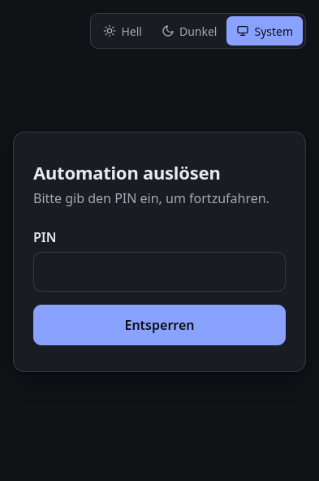
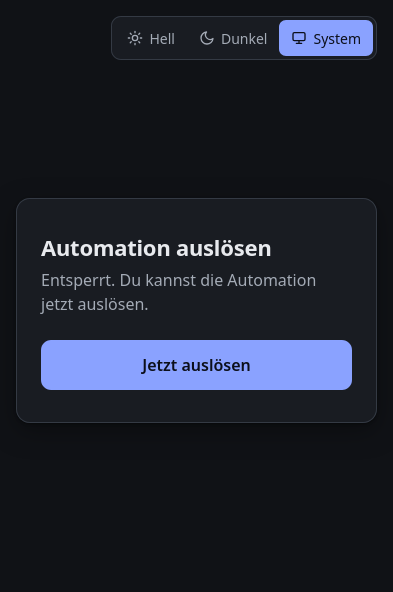
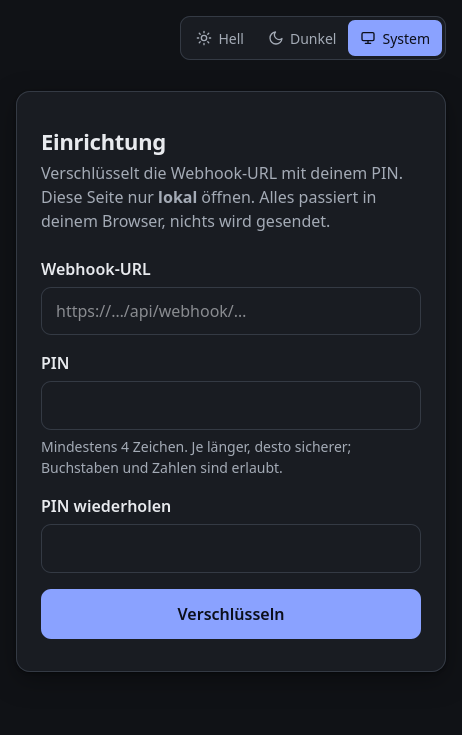

# Nachbarschaftshilfe – Automation per Knopfdruck

Statische Webseite, über die berechtigte Personen eine Home-Assistant-Automation
per Webhook auslösen können. Der Button erscheint erst nach Eingabe des richtigen PINs.

> [!WARNING]
> **Nutzung auf eigene Gefahr.** Diese Software wird ohne jede Gewährleistung
> bereitgestellt (siehe [Lizenz](#lizenz)). Wer sie einsetzt, ist selbst für die
> Sicherheit seiner Home-Assistant-Installation verantwortlich.
>
> **Nur kurzzeitig veröffentlichen.** Die Seite ist für einen begrenzten Zeitraum
> gedacht, z. B. während einer Urlaubsvertretung. Sie sollte **nicht dauerhaft**
> erreichbar sein: nach Gebrauch offline nehmen und die Webhook-ID in Home Assistant
> ändern (siehe [Sicherheitshinweise](#sicherheitshinweise)).

> [!NOTE]
> Dieses Projekt wurde mit Unterstützung von [Claude](https://claude.ai) (Anthropic)
> erstellt. Der Code wurde nicht unabhängig auf Sicherheit geprüft.

## Funktionsweise

- Die Webhook-URL liegt **verschlüsselt** in `payload.js` (AES-GCM, 256 Bit).
- Der Schlüssel wird per PBKDF2 (SHA-256, 600 000 Iterationen) aus dem PIN abgeleitet.
- Weder URL noch PIN stehen im Quelltext. Nur mit dem richtigen PIN lässt sich die
  URL entschlüsseln; danach wird der Button „Jetzt auslösen“ angezeigt.
- Nach falschen PIN-Eingaben steigt die Wartezeit (1 s, 2 s, 4 s … bis 30 s).
- Hell-, Dunkel- und Systemmodus lassen sich umschalten; die Wahl wird im Browser gespeichert.

  
  &nbsp;
  

*Links: PIN-Abfrage. Rechts: nach Eingabe des richtigen PINs.*

## Dateien

| Datei | Zweck | Veröffentlichen |
|---|---|---|
| `index.html` | Hauptseite mit PIN-Abfrage und Button | ja |
| `app.js` | Entschlüsselung und Webhook-Aufruf | ja |
| `payload.js` | Verschlüsselte Webhook-URL (lokal erzeugt, nicht im Repository) | ja |
| `payload.example.js` | Vorlage ohne URL | nein |
| `style.css` | Gestaltung (beide Seiten) | ja |
| `theme.js` | Farbschema-Umschalter und Statusanzeige (beide Seiten) | ja |
| `setup.html`, `setup.js` | Werkzeug zum Erzeugen von `payload.js` | nein, nur lokal |
| `index_ALT_ohne-PIN_NICHT-HOCHLADEN.html` | Alte Version ohne PIN, URL leicht auslesbar | **niemals** |
| `README.md` | Diese Datei | nein |
| `docs/screenshots/` | Bildschirmfotos für diese Datei | nein |
| `LICENSE` | Lizenztext (GPLv3) | nein |

## PIN oder Webhook-URL ändern

1. `setup.html` lokal im Browser öffnen (Doppelklick genügt).
2. Webhook-URL und neuen PIN eingeben, auf „Verschlüsseln“ klicken.
3. „payload.js herunterladen“ und die vorhandene `payload.js` damit ersetzen.
4. Die neue `payload.js` auf den Server hochladen.

`payload.js` ist per `.gitignore` vom Repository ausgeschlossen. Auch verschlüsselt
gehört sie nicht in ein öffentliches Repository, da ein kurzer PIN offline erraten
werden kann.

Die Webhook-URL steht in Home Assistant in der jeweiligen Automation beim Webhook-Auslöser.

## Veröffentlichen

- Nur die Dateien aus der Tabelle mit „ja“ hochladen.
- Die Seite muss über **HTTPS** ausgeliefert werden, sonst steht die Verschlüsselung
  im Browser nicht zur Verfügung.
- Home Assistant muss für die Besucher erreichbar sein und Aufrufe von der Domain der
  Seite zulassen (CORS), sonst meldet die Seite einen Netzwerk- bzw. CORS-Fehler.

## Sicherheitshinweise

- **Wer den PIN kennt, kann die URL sehen** (z. B. im Netzwerk-Tab der Entwicklerwerkzeuge)
  und den Webhook dann auch ohne die Seite aufrufen.
- **Kurze Zahlen-PINs sind knackbar.** Die Wartezeit schützt nur auf der Seite selbst.
  Wer `payload.js` herunterlädt, kann offline alle PINs durchprobieren. Ein längeres
  Passwort (z. B. 3–4 zufällige Wörter) macht das praktisch unmöglich.
- **Nicht dauerhaft betreiben.** Die Seite nur für den Zeitraum veröffentlichen, in dem
  sie tatsächlich gebraucht wird.
- **Nach Ende der Nutzung** die Seite offline nehmen und in Home Assistant die
  Webhook-ID ändern, damit eine weitergegebene URL wertlos wird.
- Für echten Schutz (URL nie beim Besucher) wäre ein kleiner Server nötig, der den PIN
  prüft und den Webhook selbst aufruft, z. B. ein Cloudflare Worker.

## Lizenz

Copyright (C) 2026 listiges-kaenguru

Dieses Programm ist freie Software: Sie können es unter den Bedingungen der
GNU General Public License, Version 3 oder (nach Ihrer Wahl) jeder späteren Version,
wie von der Free Software Foundation veröffentlicht, weitergeben und/oder ändern.

Dieses Programm wird in der Hoffnung bereitgestellt, dass es nützlich ist, jedoch
**OHNE JEDE GEWÄHRLEISTUNG**, sogar ohne die implizite Gewährleistung der
MARKTFÄHIGKEIT oder EIGNUNG FÜR EINEN BESTIMMTEN ZWECK. Details siehe
[LICENSE](LICENSE) bzw. <https://www.gnu.org/licenses/gpl-3.0.html>.
